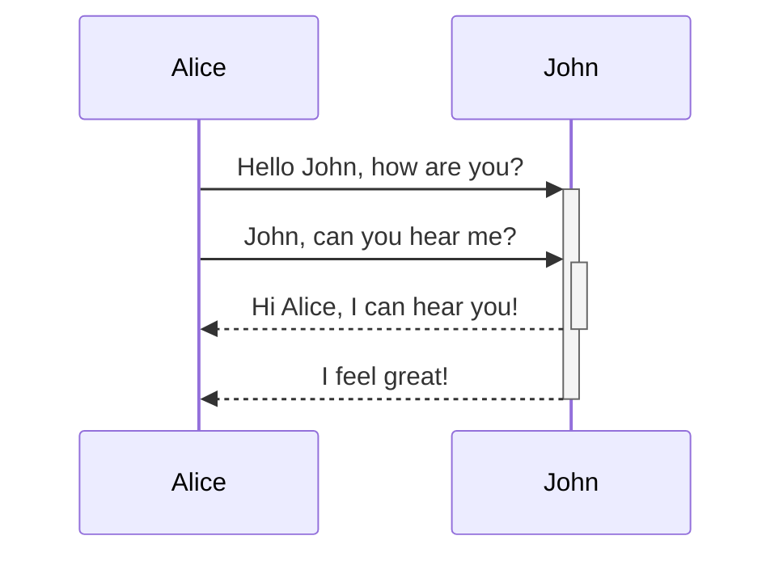

Install MapStruct support plugin in IntelliJ Idea

Made the CSV parsing static method thinking it does not need to be overridden and maintaining state in an instance and convenience of calling
Integration tests not written. Hence Controller class does not currently have tests.
Unit test coverage report can be found at target/site/jacoco/index.html after mvn clean install

Upload data

String field character lengths not validated. 
If incoming file has at least one id not existing in the database, 201 is returned upon successful operation
If all ids in the incoming file exist in the database, 200 is returned upon successful operation 

Mermaid diagram support

Enable diagram support
Press Ctrl+Alt+S to open the IDE settings and select Languages & Frameworks | Markdown.

Enable either Mermaid or PlantUML under Markdown extensions.

After IntelliJ IDEA downloads the relevant extensions, click OK to apply the changes

https://www.jetbrains.com/help/idea/markdown.html#diagrams

