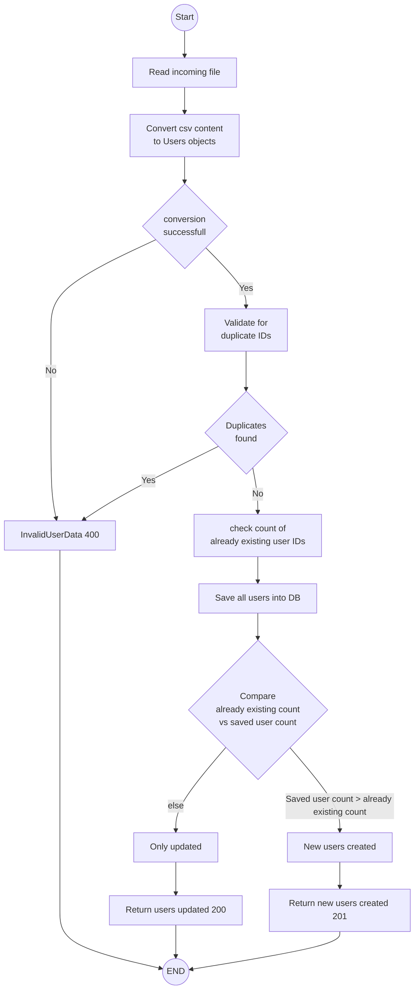

# Demo project for employee salary management
This project consists of a REST api to upload employees and later perform CRUD operations on the data.  
Currently, it uses an in memory DB to persist data. Hence, each shutdown will wipe the data

## Development setup
The project requires below tools to build
* Java IDE
* JDK 11
* Maven 
* Gitbash

### Other tools for IDE
**Mapstruct and lombok support**

The project uses **mapstruct** for bean mapping and **lombok** for code generation. You may need to install plugins to your IDE to get full compatibility during development 

**Mermaid diagram support in IDE** (Optional)

This readme file contains diagrams with mermaid syntax. Refer below link to find how to enable viewing them in the IDE  
https://www.jetbrains.com/help/idea/markdown.html#diagrams 

## Build guide
To build the code you can navigate to the needed branch and run `mvn clean install`

### Unit test results
Unit test code coverage report can be found at target/site/jacoco/index.html after running `mvn clean install`

## Run application
To run the application using the built artifact, navigate to the `/target`directory after a build and run below command in a terminal  
`java -jar employee-salary-management-0.0.1-SNAPSHOT.jar`  
**NOTE:** You may need to replace the jar file name to reflect the correct artifact name in case of version value changes etc.

### Calling REST endpoints

#### Upload users (POST /v1/users/upload)

You can find a sample file to try at: [test resources](src/test/resources/valid_users_upload_file.csv)

Curl command  
`curl -i -X POST 'http://localhost:8080/v1/users/upload' -F "file=@/c/codes/employee-salary-management/src/test/resources/valid_users_upload_file.csv"`

## Design decisions

### Upload data

* String incoming field character lengths not validated. 
* All salaries will be in same currency. 
* If incoming file has at least one id not existing in the database, 201 is returned upon successful operation
* If all ids in the incoming file exist in the database, 200 is returned upon successful operation 

